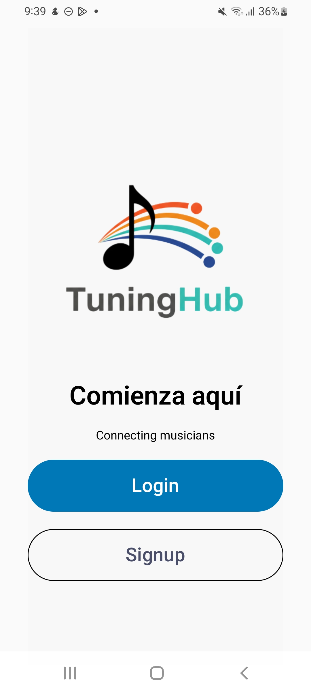
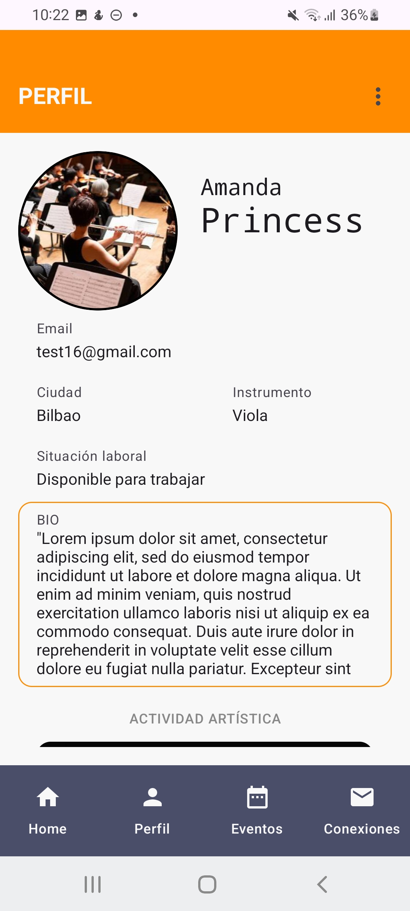
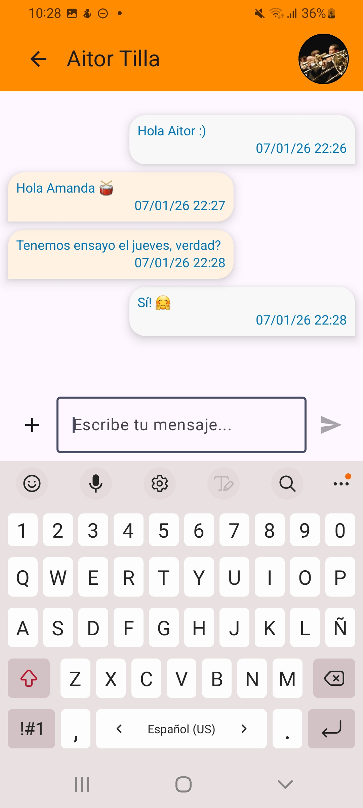

# PROYECTO_DAM_TUNINGHUB#
Proyecto de fin de grado superior en **Desarrollo de Aplicaciones Multiplataforma** en la Universidad Alfonso X El Sabio (UAX)

## DESCRIPCIÓN
🎶 Proyecto de herramienta online para mejorar el networking (empleo, proyectos, colaboraciones) en el sector de la música clásica sinfónica. Se describe como una red social que permite encontrar a estudiantes o profesionales del sector, animando a colaborar en proyectos.

## TECNOLOGÍAS
* Android Studio (IDE)
* Kotlin (lenguaje de programación)
* Jetpack Compose (UI)
* Firebase: Cloud Firestore y Storage (BBDD)

## REQUISITOS
- OS: Android
- Versión requerida: **Android 7(API 24)** o superior

## MANUAL DE INSTALACIÓN DE USUARIO
1. Ir al repositorio de Google Drive: [*LINK*](https://drive.google.com/drive/folders/1-mVVDmpP1HmQSDc-gUIR1O0BqHMSkqOY?usp=sharing)
2. Descargar el fichero ***```app-release.apk```***
3. Dar permisos al dispositivo -> es posible que haya que activar el permiso de "Instalar aplicaciones de fuentes desconocidas"
4. Si sale el aviso de "App no reconocida" -> pulsar "Instalar de todas formas

## 📷CAPTURAS DE PANTALLA
| INICIO | PERFIL | CHAT |
| :---: | :---: | :---:  |
|  |  |  |

¡A conectar! 📯🎻🎹🥁
