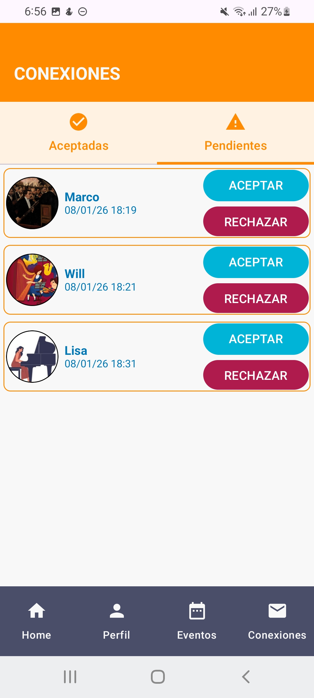

# PROYECTO FIN DE CICLO DAM: TUNINGHUB
Proyecto de fin de ciclo superior en **Desarrollo de Aplicaciones Multiplataforma** en la Universidad Alfonso X El Sabio (UAX)

## DESCRIPCIÓN
🎶 Herramienta online para mejorar el networking (empleo, proyectos, colaboraciones) en el sector de la música clásica sinfónica. Se describe como una red social que permite encontrar a estudiantes o profesionales del sector, impulsando la colaboración en proyectos.

## TECNOLOGÍAS
* Android Studio (IDE)
* Kotlin (lenguaje de programación)
* Jetpack Compose (UI)
* Firebase: Cloud Firestore y Storage (BBDD)

## REQUISITOS
- OS: Android
- Versión requerida: **Android 7(API 24)** o superior

## 📷CAPTURAS DE PANTALLA
| INICIO | PERFIL | CHAT | CONEXIONES |
| :---: | :---: | :---:  | :---: |
|  |  |  |  |

¡A conectar! 📯🎻🎹🥁
